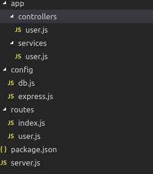
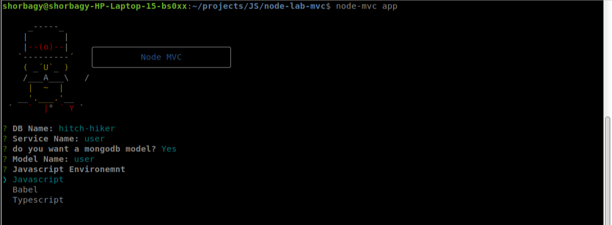
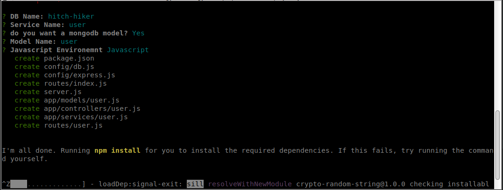

## Description

A Command Line Interface for Nodejs Boilerplates

## Installiation

To install node-boilerplate from npm, run:
```
npm i -g node-boilerplate
```

Or:

Windows
```
npm link
```

Linux or Mac:
```
$ sudo npm link
```
## Folder Structure



## Usage

Enter Command :
```
node-boilerplate app
```



You have options to put in your app like :
1. DB Name
2. Service Name
3. Mongodb Model (Optional)
4. JS Environment: [Javascript, Babel, Webpack]

After that you will find your files is created and packages is installed with <b>npm</b>:




## Packages:

You can check <b>package.json</b> for package insalled, I install my daily work packages that I use in any node application


## License

Copyright (c) 2018 Shorbagy

[MIT License](http://en.wikipedia.org/wiki/MIT_License)
